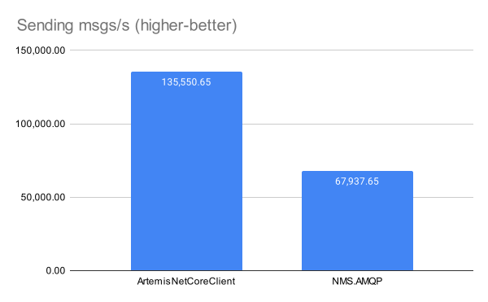

# .NET Client for Apache ActiveMQ Artemis

[](https://github.com/Havret/dotnet-activemq-artemis-core-client/actions/workflows/build.yml)

---

<div align="center">

  

</div>

---

|NuGet|Status|
|------|-------------|
|ArtemisNetCoreClient|[](https://www.nuget.org/packages/ArtemisNetCoreClient/)

Apache ActiveMQ Artemis is an open-source project to build a multi-protocol, embeddable, very high performance, clustered, asynchronous messaging system.

This .NET client library is an open-source effort to equip .NET developers with a powerful, straightforward client for Apache ActiveMQ Artemis. Utilizing the broker's Core protocol, this library focuses on high-performance messaging, ensuring compatibility and comprehensive feature support with Apache ActiveMQ Artemis.

## Quickstart

Add `ArtemisNetCoreClient` NuGet package to your project using dotnet CLI:

```sh
dotnet add package ArtemisNetCoreClient --prerelease
```

The API interfaces and classes are defined in the `ActiveMQ.Artemis.Core.Client` namespace. Make sure to include it at the top of your file:

```csharp
using ActiveMQ.Artemis.Core.Client;
```

Before sending or receiving messages, you need to establish a connection to the broker endpoint. Create a connection using the `ConnectionFactory` object.

```csharp
var connectionFactory = new ConnectionFactory();
var endpoint = new Endpoint
{
    Host = "localhost",
    Port = 61616,
    User = "guest",
    Password = "guest"
};
var connection = await connectionFactory.CreateAsync(endpoint);
```

Once the connection is established, create a session.

```csharp
var session = await connection.CreateSessionAsync();
```

Create an address and a queue for messaging.

```csharp
await session.CreateAddressAsync("a1", [RoutingType.Anycast]);
await session.CreateQueueAsync(new QueueConfiguration
{
    Address = "a1",
    Name = "q1",
    RoutingType = RoutingType.Anycast
});
```

Create a producer to send a message to the address.

```csharp
var producer = await session.CreateProducerAsync(new ProducerConfiguration
{
    Address = "a1"
});
await producer.SendMessageAsync(new Message { Body = "my-msg"u8.ToArray() });
```

Create a consumer to receive messages from the queue.

```csharp
var consumer = await session.CreateConsumerAsync(new ConsumerConfiguration
{
    QueueName = "q1"
});
var message = await consumer.ReceiveMessageAsync();
```

## Online resources

- [ActiveMQ Artemis address model explained with examples in .NET](https://havret.io/activemq-artemis-address-model) (April 19, 2022)[^1]

## Performance

> [!NOTE]
> The benchmark results seem to be a bit too good to be true. Please take them with a pinch of salt. Further investigation into potential misconfigurations is advised. For more details, see [Issue #116](https://github.com/Havret/dotnet-activemq-artemis-core-client/issues/116).

All benchmarks are executed on the following hardware and software configuration:

```sh
OS=macOS 14.5 (23F79) [Darwin 23.5.0]
Apple M1 Pro, 1 CPU, 10 logical and 10 physical cores
.NET SDK=8.0.100
  [Host]     : .NET 8.0.0 (8.0.23.53103), Arm64 RyuJIT
  DefaultJob : .NET 8.0.0 (8.0.23.53103), Arm64 RyuJIT
```

Both the benchmark applications and the broker are hosted on the same machine, with the broker running inside a Docker container. The configuration for the queues used in the benchmarks is specified within the [`broker.xml`](test/artemis/broker.xml) file. Each message used in the benchmarks contains a simple payload consisting of 1KB of randomly generated data.

The baseline for these benchmarks is set using the official [Apache NMS.AMQP library](https://github.com/apache/activemq-nms-amqp).

### Request-Reply (PingPong) Benchmark

This benchmark measures the performance in a request-reply messaging scenario. The test setup involves two components, `Ping` and `Pong`:

- **`Ping`**: Sends a message to `Pong` and starts a timer.
- **`Pong`**: Receives the message and responds back immediately.

The performance is assessed by measuring the round-trip time and calculating the throughput in terms of round-trips per second, over the course of sending and receiving 10,000 messages.

| Library                | Round-trips per Second |
|------------------------|------------------------|
| ArtemisNetCoreClient   | 1990.34                |
| NMS.AMQP               | 948.13                 |

<div align="center">
  
</div>

### Throughput

This benchmark assesses the ability of the library to handle large volumes of messages efficiently, focusing on both sending and receiving processes:

- **`Producer`**: Sends 100,000 messages. The performance metric is the rate of messages sent per second (msgs/s).
- **`Consumer`**: Receives an equivalent volume of messages. The performance metric is the rate of messages processed per second (msgs/s).

To ensure that broker disk I/O does not influence the results, messages are sent as non-durable.

Results show how quickly each library can transmit and receive messages:

| Library                | Sending msgs/s | Consuming msgs/s |
|------------------------|----------------|------------------|
| ArtemisNetCoreClient   | 135,550.65     | 138,047.69       |
| NMS.AMQP               | 67,937.65      | 65,838.88        |

<div align="center">
  
</div>

<div align="center">
  
</div>

## Running the tests

To run the tests, you need an Apache ActiveMQ Artemis server. The server can be hosted in a Docker container.

### Setting Up the Necessary Infrastructure

Ensure that Docker and Docker Compose are properly installed and configured on your machine.

1. Navigate to the `/test/artemis` directory.
2. Run the following command to spin up the broker:

```sh
docker-compose up -V -d
```

With the broker up and running, you can execute the test suite using the following command:

```sh
dotnet test
```

## Disclaimer

Please note that this project is currently under active development and is not considered production-ready. We are continuously working to improve and stabilize its features, but it does not yet meet all the requirements for production use.

If you are in search of a production-ready ActiveMQ Artemis client for .NET, we recommend checking out the [AMQP-based client](https://github.com/Havret/dotnet-activemq-artemis-client). This alternative client has been battle-tested in production environments for the last few years and supports a wide range of ActiveMQ Artemis features.

## License

This project is licensed under the [Apache-2.0 License](https://github.com/Havret/dotnet-activemq-artemis-core-client/blob/main/LICENSE). You are welcome to use it freely, without any restrictive obligations.

[^1]: Examples in this article were created using [AMQP-based client](https://github.com/Havret/dotnet-activemq-artemis-client).
